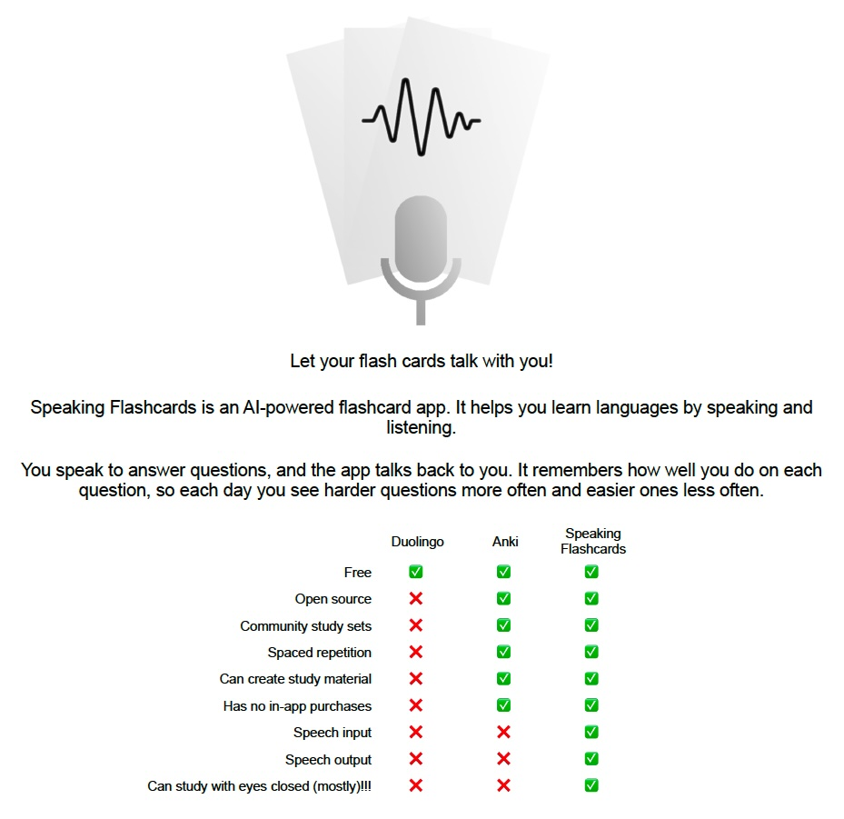

# Speaking Flashcards

Open-source speech-in/speech-out flashcards, with a unique spaced repetition system.

Speaking Flashcards:

[iOS App Store](https://apps.apple.com/ca/app/speaking-flashcards/id6670759263)

[Android Play Store](https://play.google.com/store/apps/details?id=com.speaking_flashcards.abc&hl=en)

---

To run locally:
- If you don't have Flutter, install it
  https://docs.flutter.dev/get-started/install
- Clone this repo
- In a terminal, navigate to the cloned repo
- Write `flutter pub get` and hit enter to download the packages required for Speaking Flashcards
- Then write `flutter run` and hit enter to run Speaking Flashcards in debug mode